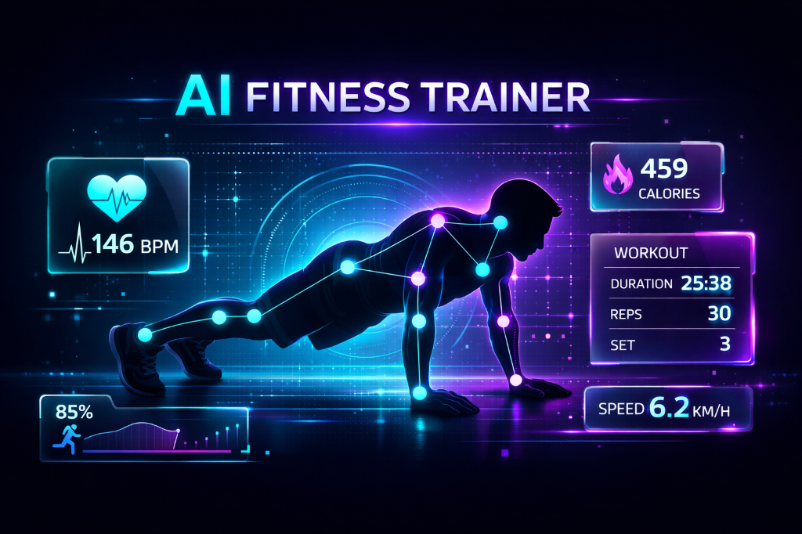
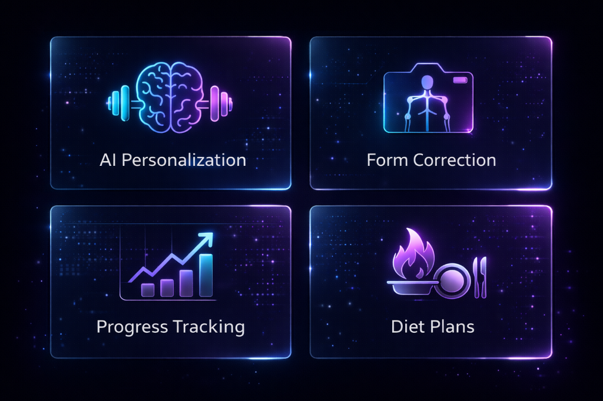
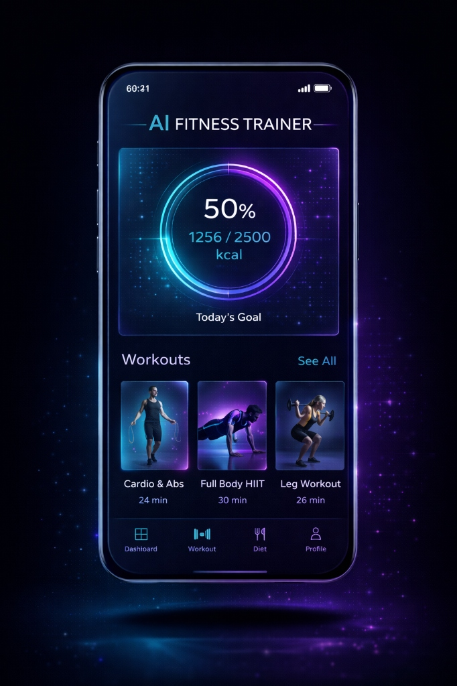
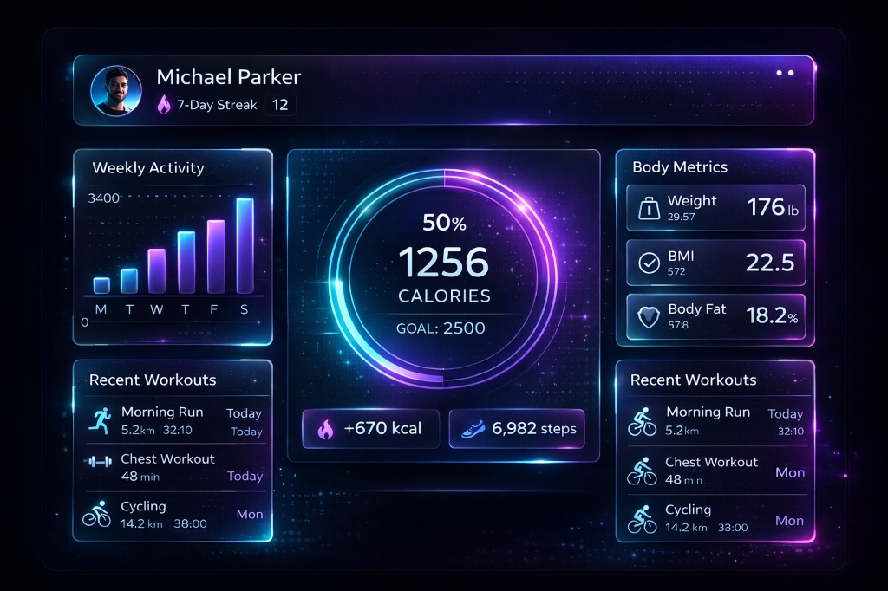
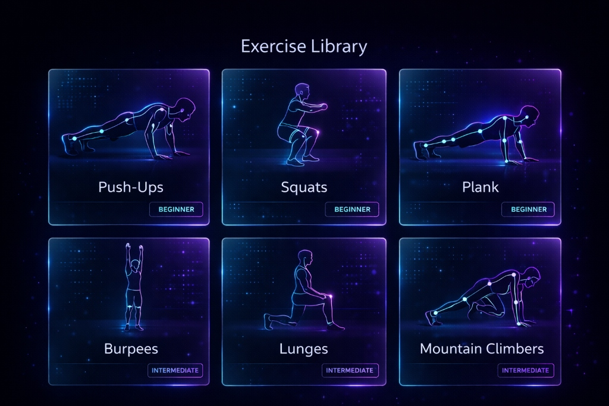

<div align="center">

# 🏋️ AI FITNESS TRAINER

### _Your Personal AI-Powered Fitness Coach_

[](https://nextjs.org/)
[](https://www.typescriptlang.org/)
[](https://www.tensorflow.org/js)
[](https://firebase.google.com/)



**Transform your fitness journey with cutting-edge AI technology**

[Live Demo](#) • [Documentation](#-getting-started) • [Report Bug](https://github.com/prashant13-bh/AI-Fitness-Trainer/issues) • [Request Feature](https://github.com/prashant13-bh/AI-Fitness-Trainer/issues)

</div>

---

## 📖 Overview

**AI Fitness Trainer** is a revolutionary web application that combines **Artificial Intelligence**, **Computer Vision**, and **Real-time Analytics** to provide you with a personalized fitness experience like never before. Get custom workout plans, real-time form correction, diet recommendations, and comprehensive progress tracking—all in one sleek, dark-themed interface.

## ✨ Key Features

<div align="center">



</div>

### 🤖 AI-Powered Personalization

Generate custom workout routines and diet plans tailored to your unique body type, fitness goals, and experience level using advanced **Google Gemini AI**.

### 📷 Real-Time Form Correction

Leverage **TensorFlow.js** and **MoveNet** pose detection to analyze your exercise form through your webcam. Get instant feedback and corrections to prevent injuries and maximize results.

### 📊 Smart Progress Analytics

Track every metric that matters—reps, sets, calories burned, workout duration, and more. Visualize your progress with beautiful charts and insights.

### 🔐 Secure & Private

Your data is protected with **Firebase Authentication** and **Firestore**, ensuring enterprise-grade security for your personal health information.

### 🎨 Premium UI/UX

Experience a modern, responsive interface with dark mode, glassmorphism effects, and neon accents that make fitness tracking enjoyable.

---

## 🖼️ Screenshots

### 📱 Mobile Experience

<div align="center">



_Seamless mobile experience with intuitive navigation and real-time tracking_

</div>

### 💻 Dashboard

<div align="center">



_Comprehensive dashboard with weekly activity, body metrics, and workout history_

</div>

### 🏃 Exercise Library

<div align="center">



_Extensive exercise library with visual guides and difficulty levels_

</div>

---

## 🛠️ Technology Stack

### Frontend

- **Framework:** [Next.js 14](https://nextjs.org/) (App Router)
- **Language:** [TypeScript](https://www.typescriptlang.org/)
- **Styling:** [Tailwind CSS](https://tailwindcss.com/) & [Shadcn/UI](https://ui.shadcn.com/)

### AI & Machine Learning

- **Pose Detection:** [TensorFlow.js](https://www.tensorflow.org/js) + [MoveNet](https://www.tensorflow.org/hub/tutorials/movenet)
- **AI Generation:** [Google Gemini API](https://ai.google.dev/)
- **MediaPipe:** Real-time body tracking

### Backend & Database

- **Authentication:** [Firebase Auth](https://firebase.google.com/docs/auth)
- **Database:** [Cloud Firestore](https://firebase.google.com/docs/firestore)
- **Storage:** Firebase Storage

---

## 🚀 Getting Started

### Prerequisites

Before you begin, ensure you have the following installed:

- **Node.js** (v18 or higher)
- **npm** or **pnpm**
- **Git**

### Installation

1️⃣ **Clone the repository**

```bash
git clone https://github.com/prashant13-bh/AI-Fitness-Trainer.git
cd AI-Fitness-Trainer
```

2️⃣ **Install dependencies**

```bash
npm install
# or
pnpm install
```

3️⃣ **Configure Environment Variables**

Create a `.env.local` file in the root directory:

```env
# Firebase Configuration
NEXT_PUBLIC_FIREBASE_API_KEY=your_firebase_api_key
NEXT_PUBLIC_FIREBASE_AUTH_DOMAIN=your_project_id.firebaseapp.com
NEXT_PUBLIC_FIREBASE_PROJECT_ID=your_project_id
NEXT_PUBLIC_FIREBASE_STORAGE_BUCKET=your_project_id.appspot.com
NEXT_PUBLIC_FIREBASE_MESSAGING_SENDER_ID=your_sender_id
NEXT_PUBLIC_FIREBASE_APP_ID=your_app_id
NEXT_PUBLIC_FIREBASE_MEASUREMENT_ID=your_measurement_id

# AI Gateway / Gemini API
AI_GATEWAY_API_KEY=your_ai_gateway_api_key
```

> ⚠️ **Important:** Never commit your `.env.local` file to GitHub. It's already included in `.gitignore`.

4️⃣ **Run the development server**

```bash
npm run dev
```

5️⃣ **Open your browser**

Navigate to [http://localhost:3000](http://localhost:3000) to see the application.

---

## 📁 Project Structure

```
ai-fitness-trainer/
├── public/
│   └── screenshots/       # Application screenshots
├── src/
│   ├── app/              # Next.js app router pages
│   ├── components/       # React components
│   │   ├── ui/          # Shadcn/UI components
│   │   └── trainer/     # Fitness-specific components
│   └── lib/             # Utility functions & config
├── .env.local           # Environment variables (create this)
├── next.config.ts       # Next.js configuration
├── tailwind.config.ts   # Tailwind CSS configuration
└── package.json         # Project dependencies
```

---

## 🤝 Contributing

Contributions, issues, and feature requests are welcome!

1. Fork the Project
2. Create your Feature Branch (`git checkout -b feature/AmazingFeature`)
3. Commit your Changes (`git commit -m 'Add some AmazingFeature'`)
4. Push to the Branch (`git push origin feature/AmazingFeature`)
5. Open a Pull Request

---

## 📝 License

This project is licensed under the **MIT License** - see the [LICENSE](LICENSE) file for details.

---

## 👨‍💻 Author

**Prashant B Hiremath**

- GitHub: [@prashant13-bh](https://github.com/prashant13-bh)
- Project Link: [https://github.com/prashant13-bh/AI-Fitness-Trainer](https://github.com/prashant13-bh/AI-Fitness-Trainer)

---

## 🙏 Acknowledgments

- [TensorFlow.js](https://www.tensorflow.org/js) for pose detection capabilities
- [Google Gemini](https://ai.google.dev/) for AI-powered personalization
- [Shadcn/UI](https://ui.shadcn.com/) for beautiful UI components
- [Firebase](https://firebase.google.com/) for backend infrastructure

---

<div align="center">

**⭐ Star this repository if you found it helpful!**

Made with ❤️ and 🤖 AI

</div>
